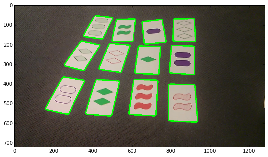

# Contours


##### Objectives and Outcomes

In this article, you will learn how to find and draw contours along with the implementation of some of the handy contour features and functions.


### What are Contours?

A **contour line** is simply a curve line that joins all the continuous points (along the boundary) that have the same values or the same intensities. Basically, contour can be defined as an outline or a border of  any object.

[^Note]: Do not confuse contours with edges. Edges lies in a local range: they only point out the difference between the neighbouring pixels. Contours are often obtained from **edges**, but they need to be closed curves. Think of them as boundaries.




### Uses of contours

Contours are mainly used for object detection. It can be used used to determine **size**, **shape**, and **area** of an object. Contour lines are also used in topographic maps to determine elevations. Contour maps plays a vital role in any types of engineering work and some of its functionalities range from **shape analysis** to **object detection** and **recognition**.


### To find contours

To find contours with better accuracy, it is recommended to use binary images. In OpenCV, finding contours is like finding a contrast between two colours, like finding  a white object from black background. 

This can be easily done by converting the image to grayscale by using-

```python
img_gray = cv2.cvtColor(image_name, cv.COLOR_BGR2GRAY)
```

and then applying threshold or canny edge detection by using-

```python
a = img_gray.max()  
_, thresh = cv2.threshold(img_gray, a/2+60, a,cv2.THRESH_BINARY_INV)
```

 Lets test this on a tomato

```
import numpy as np
import cv2 
im = cv2.imread('tomato.jpg')
im=cv2.resize(im,(256,256))
imgray = cv2.cvtColor(im, cv.COLOR_BGR2GRAY)
# ret, thresh = cv.threshold(imgray, 127, 255, 0)
a = imgray.max()  
_, thresh = cv2.threshold(imgray, a/2+60, a,cv2.THRESH_BINARY_INV)
```

<p float="center">
  
   
</p>

Now, the syntax for **finding** contours is simply,

```
contours, hierarchy = cv.findContours(thresh, cv.RETR_TREE, cv.CHAIN_APPROX_SIMPLE)
```

*Contours* in Python is a ***list*** of contours of an object, which can be an image, a frame from a video and so on. Each *Contour* in the list *Contours* is a point represented as (x , y) which represents the position of the point on a 2d map.


### How to draw the Contours?

***cv.drawContours*** function is used to draw contours. It can also be used to draw any shape by giving their boundary points. First argument is the source image, second image is the list of contours and third argument is index of contours (To draw all contours, pass -1). Remaining arguments would be rgb color information, thickness, etc.

- To draw all the contours in an image:

  ```
  cv2.drawContours(img, contours, -1, (0,255,0), 3)
  ```

  The above example looks like -

   

- To draw an individual contour in an image, say 1st contour:

  ```
  cv2.drawContours(img, contours, 0, (0,255,0), 3) 
  #'0' in third positon indicates first index
  ```

  

  ### Contour Approximation Method

  This is the third argument in ***cv.findContours*** function. 

  If we pass **cv.CHAIN_APPROX_NONE** , all the boundary points are stored. But sometimes, we dont really need all the boundary points. For example, if we want to represent a line, we only need the first and last point. This is what **cv.CHAIN_APPROX_SIMPLE** does. It removes all the redundant points, thus saving memory.
